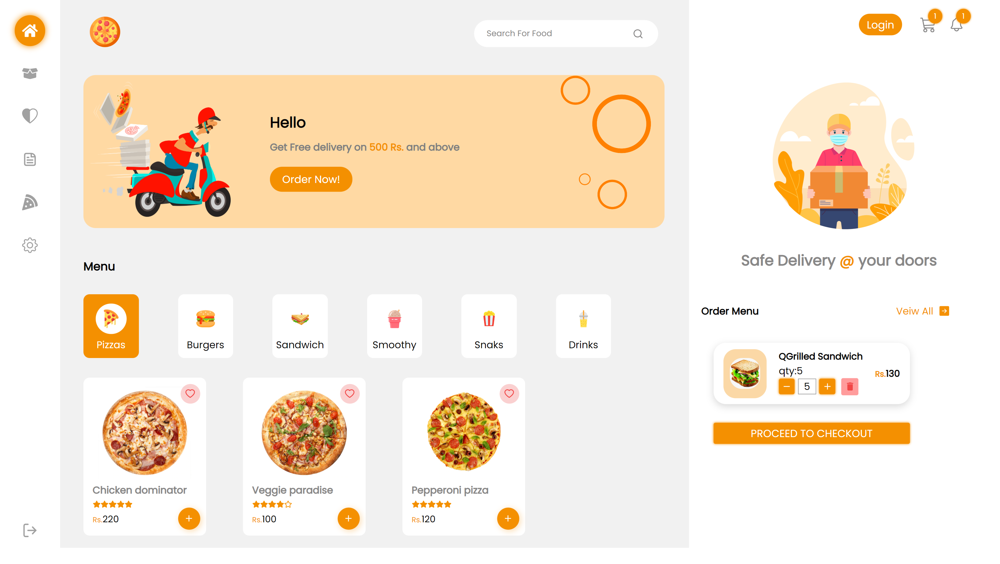
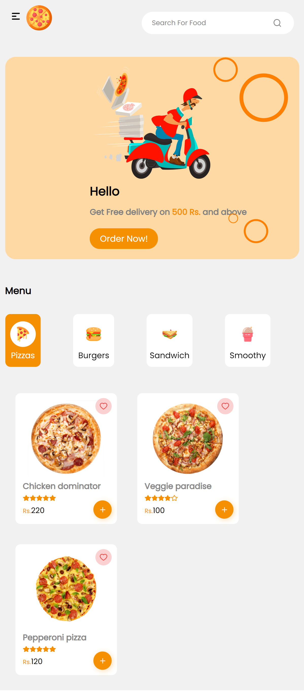
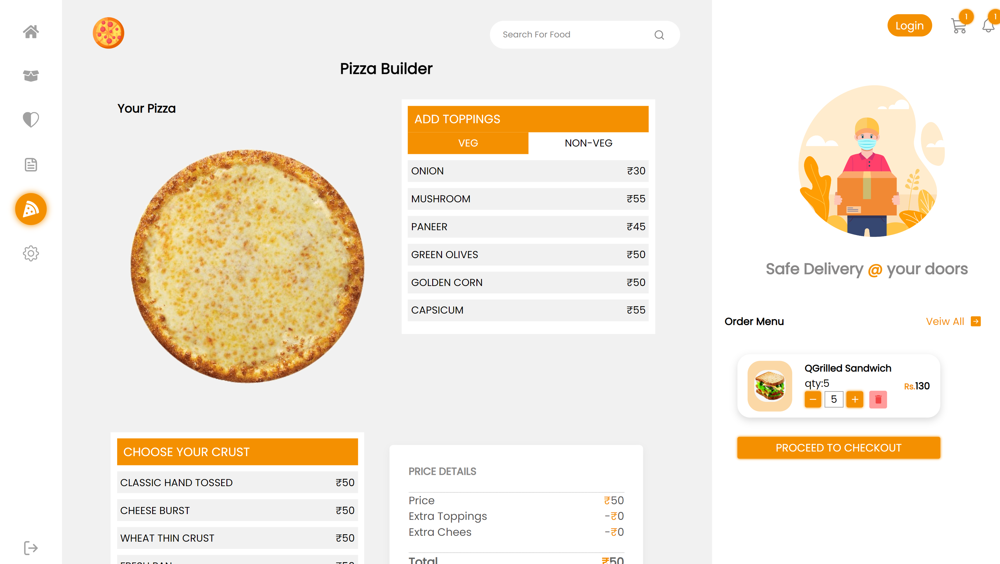

# Spider Pizza

  

 

> Project for Spider 3.0 hackathon.
> Spider pizza is web app that helps customer to order fast food and main feature that helps to make customized pizzas. 
> Web app uses modern React features like Modules, Skeletons, etc.

## ⚙️ Detailed Functionality
* Theme is about Business Landing Site.
* Theme is about Business Landing Site so we have focused on cafe shop.
* Landing page gives all the info about cafe menus like pizza, burgers, drinks, etc.
* It has also a custom pizza builder which gives customer to add their own ingredients on pizza.
* Sign in, sign up, cart etc. included.
* Used React Skelton loading screens.
* Filter for various menus like pizza, burgers, drinks, etc.
* Searching the menus in the cafe shop.
 
## 🚀 Tech and Tools Used

* React.JS, Redux, CSS
* VS code, Netlify
* React Icons

## 📸 Screenshots

## Landing page

 

## Mobile View

 

## Pizza builder

 

### Deployment Link : https://pizza-app-spiderhackathon.netlify.app/
